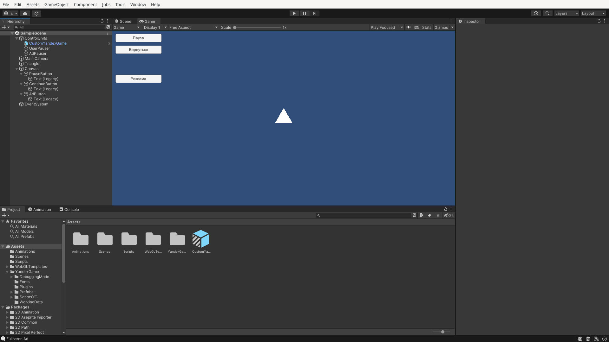

# Гайд: как совместить рекламу и паузу

## Общее описание

Главный компонент `SuringFun.GamePauser`. Содержит `PauseUnit`, через который происходит манипуляция паузой.

Также, для правильной работы был настроен префаб `YandexGame`: изменено свойство `Viewing Ads YG -> Pause Type` (см. префаб `CustomYandexGame`).

В качестве примеров использования предоставлены компоненты `UserPauser` и `AdPauser` &mdash; скрипты просто используют `GamePauser`.

## Принцип работы

На игру заводится 1 голбальный счётчик &mdash; счётчик запросов на паузу. Когда кто-то ставит игру на паузу, счётчик увеличивается на единицу. Когда отменяет паузу &mdash; счётчик уменьшается на единицу.

Действия по включению паузы нужно производить только когда счётчик меняет значение с `0` на `> 0`, действия по возобновлению игры &mdash; с `> 0` на `0`.

Таким образом, этот механизм позволяет нам запросить паузу сразу с нескольких компонентов.

## Зачем нам `GamePauser.PauseUnit`?

В самом примитивном случае достаточно менять счётчик напрямую, но очень важно следить за правильной последовательностью `++` и `--` &mdash; если будут выполнены лишние действия, либо игра не поставиться на паузу (`--` > `++`), либо не возобновится (`++` > `--`). с усложнением логики компонентов, становится всё сложнее этот аспект отслеживать. По этой причине логика обновления счётчика была скрыта в `PauseUnit`.

`PauseUnit` предоставляет простой интерфейс &mdash; свойство `Paused`. Объект сам отслеживает необходимость обновления счётчика.
